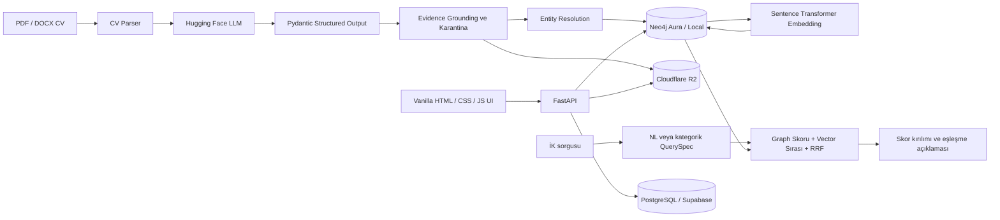

# TalentForge

<p align="center">
  
</p>

<p align="center">
  <strong>LLM ile CV'lerden bilgi grafı inşası ve açıklanabilir hibrit aday eşleştirme sistemi</strong>
</p>

<p align="center">
  
  
  
  
  
</p>

TalentForge; PDF ve DOCX biçimindeki özgeçmişleri LLM ile yapısal verilere
dönüştürür, doğrulanan varlık ve ilişkileri Neo4j bilgi grafına yazar ve İK
uzmanlarının kriterlerine göre adayları graph + vector sinyalleriyle sıralar.
Sistem yalnızca bir skor üretmez; eşleşmenin nedenlerini, eksik kriterleri ve
skor kırılımını da gösterir.

Proje, Marmara Üniversitesi Bilgisayar Mühendisliği Bitirme Projesi kapsamında
geliştirilmiştir.

## İçindekiler

- [Öne Çıkan Özellikler](#öne-çıkan-özellikler)
- [Sistem Mimarisi](#sistem-mimarisi)
- [CV İşleme Akışı](#cv-işleme-akışı)
- [Eşleştirme Motoru](#eşleştirme-motoru)
- [Teknoloji Yığını](#teknoloji-yığını)
- [Kurulum](#kurulum)
- [Kullanım](#kullanım)
- [API Özeti](#api-özeti)
- [Deneyler ve Sonuçlar](#deneyler-ve-sonuçlar)
- [Proje Yapısı](#proje-yapısı)

## Öne Çıkan Özellikler

- **LLM tabanlı CV çıkarımı:** Aday, deneyim, eğitim, proje, yetenek, dil ve
  sertifika bilgilerinin doğrulanmış JSON şemasına çıkarılması
- **Evidence grounding:** LLM çıktılarının kaynak CV metnine göre doğrulanması,
  desteklenmeyen çıkarımların karantinaya alınması
- **Neo4j bilgi grafı:** Aday merkezli varlık ve ilişki modeli
- **Entity resolution:** Türkçe karakter normalizasyonu, alias sözlüğü ve
  RapidFuzz eşikleriyle aynı kavramın tek kanonik düğümde birleştirilmesi
- **Semantic embedding:** Aday profillerinin vektörleştirilmesi ve Neo4j vector
  index üzerinden anlamsal yakınlık sinyali
- **Doğal dil ve kategorik arama:** İK sorgularının kontrollü `QuerySpec`
  yapısına dönüştürülmesi
- **Açıklanabilir hibrit matching:** Aktif kriter normalizasyonu, must-have
  gate, fuzzy skill matching ve Reciprocal Rank Fusion
- **Rol bazlı ürün:** İK ve aday panelleri, ilanlar, başvurular, kaydedilen
  adaylar/aramalar ve mesajlaşma
- **Güvenli CV depolama:** SHA-256 ile tekrar yükleme kontrolü ve Cloudflare R2
  üzerinde dosya saklama
- **Tekrarlanabilir tez deneyleri:** Extraction, KG construction, matching ve
  entity resolution için otomatik metrik, tablo ve JPEG grafik üretimi

## Sistem Mimarisi



### Veri sorumlulukları

| Katman | Sorumluluk |
|---|---|
| Neo4j | Aday bilgi grafı, ilişkiler, profil embedding'leri |
| PostgreSQL | Kullanıcılar, roller, ilanlar, başvurular, kayıtlı aramalar, kaydedilen adaylar, mesajlar |
| Cloudflare R2 | Hash ile ilişkilendirilmiş CV dosyaları |
| FastAPI | Kimlik doğrulama, pipeline orkestrasyonu, arama ve ürün API'leri |
| Frontend | Sunum/ürün ana sayfası ile İK ve aday çalışma alanları |

## CV İşleme Akışı

1. Dosyanın SHA-256 hash'i hesaplanır; daha önce işlenen CV varsa mevcut graf
   doğrudan getirilir.
2. PDF veya DOCX içeriği parse edilerek ham metin çıkarılır.
3. LLM, metni doğrulanan Pydantic şemasına dönüştürür.
4. Evidence grounding katmanı çıkarımları CV metniyle karşılaştırır.
5. Desteklenmeyen bilgi ve ilişkiler karantinaya alınır.
6. Varlıklar normalize edilir ve entity resolution uygulanır.
7. Aday, deneyim, eğitim, proje, şirket, yetenek, dil ve sertifika düğümleri
   Neo4j'ye yazılır.
8. Aday profili embed edilerek vector index'e eklenir.
9. CV dosyası yapılandırılmış profil ile ilişkilendirilerek R2'da saklanır.

Temel graf ilişkileri:

```text
(Candidate)-[:HAS_SKILL]->(Skill)
(Candidate)-[:HAS_EXPERIENCE]->(Experience)-[:AT_COMPANY]->(Company)
(Experience)-[:USED_SKILL]->(Skill)
(Candidate)-[:HAS_EDUCATION]->(Education)-[:AT_INSTITUTION]->(Institution)
(Candidate)-[:HAS_PROJECT]->(Project)-[:PROJECT_USED_SKILL]->(Skill)
(Candidate)-[:HAS_CERTIFICATION]->(Certification)
(Candidate)-[:SPEAKS]->(Language)
```

## Eşleştirme Motoru

İK uzmanı kriterleri form üzerinden veya doğal dille girer. Doğal dil sorgusu
önce kontrollü bir `QuerySpec` nesnesine çevrilir. Yalnızca sorguda bulunan
kriterler skorlamaya katılır; boş kriterler adaya puan kazandırmaz.

Kullanılan sinyaller:

- Zorunlu ve tercih edilen yetenekler
- Pozisyon ve kıdem
- Minimum deneyim
- Eğitim kurumu / eğitim seviyesi
- Lokasyon, dil ve sertifikalar
- Aday profilinin anlamsal vektör benzerliği

Yakın yazımlar ve eş anlamlı beceriler normalize/fuzzy eşleştirme ile
değerlendirilir. Zorunlu yetenek uyumu çok düşük adaylar must-have gate ile
baskılanır. Yapısal graph sırası ve vector sırası, Reciprocal Rank Fusion ile
birleştirilir. Sonuçta toplam skorun yanında kriter bazlı skor kırılımı ve
eşleşme gerekçeleri döndürülür.

## Teknoloji Yığını

| Alan | Teknoloji |
|---|---|
| Backend | Python 3.11+, FastAPI, Pydantic, SQLAlchemy |
| LLM çıkarımı | Hugging Face Inference, Instructor, Qwen2.5 |
| Embedding | Sentence Transformers, multilingual MiniLM |
| Bilgi grafı | Neo4j 5.x / Neo4j Aura, Cypher, vector index |
| İlişkisel veri | PostgreSQL / Supabase, Alembic |
| Dosya depolama | Cloudflare R2, boto3 |
| Eşleştirme | Graph scoring, RapidFuzz, vector similarity, RRF |
| CV parsing | unstructured, pdfplumber, PyMuPDF, python-docx, Tesseract |
| Arayüz | Vanilla HTML, CSS ve JavaScript |
| Geliştirme | uv, Docker Compose, pytest, Ruff |

## Kurulum

### Gereksinimler

- Python 3.11+
- [uv](https://docs.astral.sh/uv/)
- Neo4j 5.x veya Neo4j Aura bağlantısı
- PostgreSQL veya Supabase bağlantısı
- Hugging Face token
- İsteğe bağlı: Cloudflare R2 kimlik bilgileri
- PDF/OCR işlemleri için Poppler ve Tesseract

### 1. Repoyu klonlayın

```bash
git clone <repository-url>
cd talentforge
```

### 2. Bağımlılıkları kurun

```bash
uv sync
```

### 3. Ortam değişkenlerini hazırlayın

PowerShell:

```powershell
Copy-Item .env.example .env
```

Bash:

```bash
cp .env.example .env
```

Ardından `.env` içindeki en az şu alanları doldurun:

```dotenv
NEO4J_URI=neo4j+s://<instance-id>.databases.neo4j.io
NEO4J_USERNAME=neo4j
NEO4J_PASSWORD=<password>

DATABASE_URL=postgresql://<user>:<password>@<host>:6543/postgres?sslmode=require

HF_TOKEN=<hugging-face-token>
LLM_BACKEND=huggingface
LLM_MODEL=Qwen/Qwen2.5-7B-Instruct

R2_ENDPOINT=https://<account-id>.r2.cloudflarestorage.com
R2_ACCESS_KEY_ID=<access-key>
R2_SECRET_ACCESS_KEY=<secret-key>
R2_BUCKET=talentforge-cvs

SECRET_KEY=<strong-random-secret>
```

> Gerçek anahtarları `.env.example` veya Git geçmişine eklemeyin.

### 4. PostgreSQL şemasını oluşturun

```bash
uv run alembic upgrade head
```

### 5. Uygulamayı çalıştırın

```bash
uv run uvicorn app.main:app --host 127.0.0.1 --port 8000
```

Windows'ta `--reload` port/izin problemi oluşturursa yukarıdaki komutu reload
olmadan kullanın.

| Adres | Açıklama |
|---|---|
| `http://127.0.0.1:8000/ui/` | TalentForge web arayüzü ve proje sunumu |
| `http://127.0.0.1:8000/docs` | Swagger API dokümantasyonu |
| `http://127.0.0.1:8000/health` | Servis sağlık kontrolü |

### Yerel altyapıyı Docker ile çalıştırma

Cloud servisleri yerine yerel Neo4j, PostgreSQL ve Redis kullanmak için:

```bash
docker compose up -d neo4j postgres redis
```

Yerel servis adresleri:

- Neo4j Browser: `http://localhost:7474`
- Neo4j Bolt: `bolt://localhost:7687`
- PostgreSQL: `localhost:5432`
- Redis: `localhost:6379`

## Kullanım

### İK akışı

1. Şirket e-postasıyla İK hesabı oluşturun.
2. Kategorik veya doğal dil sorgusuyla aday arayın.
3. Açıklanabilir skorları ve aday bilgi grafını inceleyin.
4. Aramayı veya adayı kaydedin.
5. İlan oluşturun, başvuruları değerlendirin ve adayla mesajlaşın.

### Aday akışı

1. Aday hesabı oluşturun.
2. Bir veya birden fazla role özel CV yükleyin.
3. Çıkarılan profilleri inceleyip bilgi grafına kaydedin.
4. Hibrit matching motorunun önerdiği ilanları görüntüleyin.
5. Başvuruları ve İK mesajlarını takip edin.

### Üyeliksiz canlı demo

Ana sayfadaki **CV yükle** alanı, gerçek extraction pipeline'ını çalıştırır ve
oluşan profili/bilgi grafını gösterir. Aynı dosya daha önce işlendiyse tekrar
LLM çağrısı yapmak yerine mevcut Neo4j grafı getirilir.

## API Özeti

| Grup | Örnek endpoint'ler |
|---|---|
| Kimlik | `POST /auth/register`, `POST /auth/login`, `GET /me` |
| CV pipeline | `POST /upload-cv`, `POST /preview-cv`, `POST /commit-cvs` |
| Aday | `GET /candidates/{id}`, `GET /download-cv/{id}`, `DELETE /candidate-cvs/{id}` |
| Arama | `POST /search-candidates`, `POST /nl-search` |
| İlan ve başvuru | `GET/POST /jobs`, `POST /jobs/{id}/apply`, `GET /applications/me` |
| Kayıtlı içerik | `GET/POST /saved-searches`, `GET/POST /shortlists` |
| Mesajlaşma | `GET /messages`, `POST /messages/conversations`, `POST /messages/{id}` |
| Bakım | `POST /resolve-entities`, `POST /embed-all`, `GET /health` |

Tüm istek/yanıt şemaları için uygulama çalışırken `/docs` sayfasını kullanın.

## Deneyler ve Sonuçlar

Proje, kontrollü olarak oluşturulan **100 gold-standard CV** üzerinde
değerlendirilmiştir. Veri seti; farklı rol aileleri, diller, zorluk seviyeleri,
şablonlar ve PDF/DOCX biçimlerini kapsar. Her CV için gold extraction ve
beklenen graph ilişkileri hazırlanmıştır.

### Final deney özeti

| Deney | Sonuç |
|---|---:|
| En yüksek NER F1 | **0.965** |
| En yüksek Skill F1 | **0.974** |
| En yüksek Education F1 | **0.940** |
| En yüksek KG Triple F1 | **0.812** |
| Matching Strong Hit@3 | **0.900** |
| Matching NDCG@10 | **0.650** |
| Entity Resolution başarı oranı | **0.780** |
| Pipeline başarı oranı | **1.000** |

Final sonuç raporu:
[`evaluation/thesis_outputs/final_100/reports/thesis_report_summary.md`](evaluation/thesis_outputs/final_100/reports/thesis_report_summary.md)

Tez deneylerini yeniden çalıştırmak, CSV tabloları ve JPEG grafikleri üretmek
için:
[`evaluation/README_THESIS_TESTS.md`](evaluation/README_THESIS_TESTS.md)

Ana deney başlıkları:

- Prompt/pipeline ablation: `BL-1`, `BL-2`, `SYS-A`, `SYS-B`
- Aktif sistemde Hugging Face model karşılaştırması
- NER, skill, company, education ve relation extraction F1
- KG triple precision, recall ve F1
- Halüsinasyon / unsupported extraction ve unsupported triple oranları
- Matching Hit@K, Recall@10, MRR ve NDCG@10
- Entity resolution merge başarı oranı
- Veri seti dağılım ve node coverage analizi

## Proje Yapısı

```text
talentforge/
├── app/
│   ├── core/               # Ayarlar, Neo4j/PostgreSQL ve R2 bağlantıları
│   ├── extraction/         # Parser, LLM, validation, KG loader, ER, embedding
│   ├── models/             # PostgreSQL modelleri
│   ├── query/              # NL parser ve hibrit matching motoru
│   ├── schemas/            # Pydantic istek/yanıt şemaları
│   └── main.py             # FastAPI endpoint'leri
├── alembic/                # PostgreSQL migration'ları
├── data/cvs/               # Değerlendirme CV'leri
├── evaluation/             # Gold veriler, test runner'ları ve tez çıktıları
├── frontend/               # Sunum ana sayfası ve rol bazlı ürün arayüzü
├── scripts/                # Yardımcı çalıştırma scriptleri
├── tests/                  # Otomatik testler
├── docker-compose.yml
├── pyproject.toml
└── README.md
```

## Geliştirenler

- Gizem Özdemir
- Muhammed Emin Solakoğlu
- Emre Kılıç

**Danışman:** Doç. Dr. Buket Doğan<br>
**Kurum:** Marmara Üniversitesi, Teknoloji Fakültesi, Bilgisayar Mühendisliği

## Akademik Kullanım

Bu depo bir bitirme projesi ve tez çalışmasının uygulama çıktısıdır. Veri seti,
deney konfigürasyonları ve üretilen sonuçlar kullanılırken çalışmaya uygun
atıf verilmesi rica olunur.
